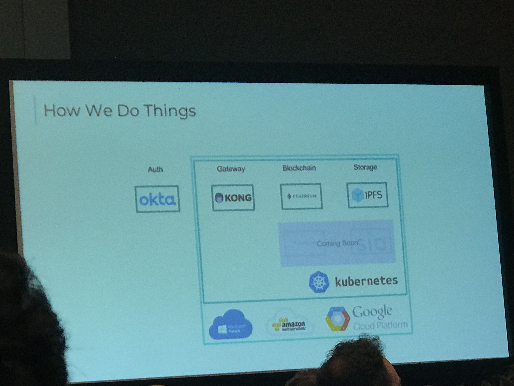

# Blockchain
<!-- TOC -->

- [Blockchain](#blockchain)
- [1. What Is Blockchain? How Will It Change The World?](#1-what-is-blockchain-how-will-it-change-the-world)
    - [1.1. Intro](#11-intro)
    - [1.2. Links](#12-links)
    - [1.3. Notes](#13-notes)
- [2. Blockchain value and limitation](#2-blockchain-value-and-limitation)
    - [2.1. Links](#21-links)
    - [2.2. Notes](#22-notes)
- [3. Blockchain Development, Simplified](#3-blockchain-development-simplified)
- [Intro](#intro)
    - [Notes](#notes)

<!-- /TOC -->
# 1. What Is Blockchain? How Will It Change The World?
## 1.1. Intro
Blockchain technology is often compared with the Internet and the impact of it is expected to be even greater. We are already witnessing how it is radically transforming the world and have realised that it is not just a toy for geeks, but an efficient tool which can be deployed by financial institutions, businesses, governments and individuals. But how does it actually work? Dr. Julian Hosp, one of the world’s top blockchain experts, will explain the basics of blockchain, why it's the beginning of a new era and what profound possibilities it can bring to society and economy. It is his mission to help people all around the world to become #cryptofit for the new decentralized world. Are you ready to join the revolution?

## 1.2. Links
- [His book: Cryptocurrencies simply explained](https://www.amazon.com/Cryptocurrencies-simply-explained-Co-Founder-Decentralization/dp/9881485088/ref=sr_1_3?ie=UTF8&qid=1521043996&sr=8-3&keywords=crypto+currencies)
- [Recording](https://schedule.sxsw.com/2018/events/PP98978)
- [@TenX](https://twitter.com/tenxwallet)

## 1.3. Notes
- Grypto currencies
- Consensus
- Centralized vs decentralized 
- Distributed ledger technology (DLT)
- Cryptocurency
- Bitcoin ... different rules. supply, transfering, account management
- Not real time, need some group to agree
- 10% of global GDP to be stored on blockchains by 2025.
- He believes the time is now ready, because technology, economy and society are ready. 

# 2. Blockchain value and limitation
## 2.1. Links
- [digitaltown](https://digitaltown.com/)

## 2.2. Notes
- Community Challenges
    - Verified identity and secured personal data
    - Electronic payments without fees
        - Paypal
        - Amazon. 
        - They know something about you
        - Move from providing copies of documents to sharing attestations
    - Residernt owndership for the community platform
    - Encourage people to get involved 

- Control over persional data
    - Once you have established Indentity on Blockchain, you actually have some very simple but effective tools for securely sharing data.

# 3. Blockchain Development, Simplified

# Intro
Blockchain is white hot right now, but how can you build safe, secure, and scalable systems on it? This talk covers the caveats of blockchain development and how to accelerate the development process. The technologies covered in this talk will include: Ethereum, IPFS, Docker / Kubernetes, React, and Redux.

## Notes
- Seamless Integration
- React + Redux
- Redux Overview
- Transcation on Ethereum
- transmute.industries

    

