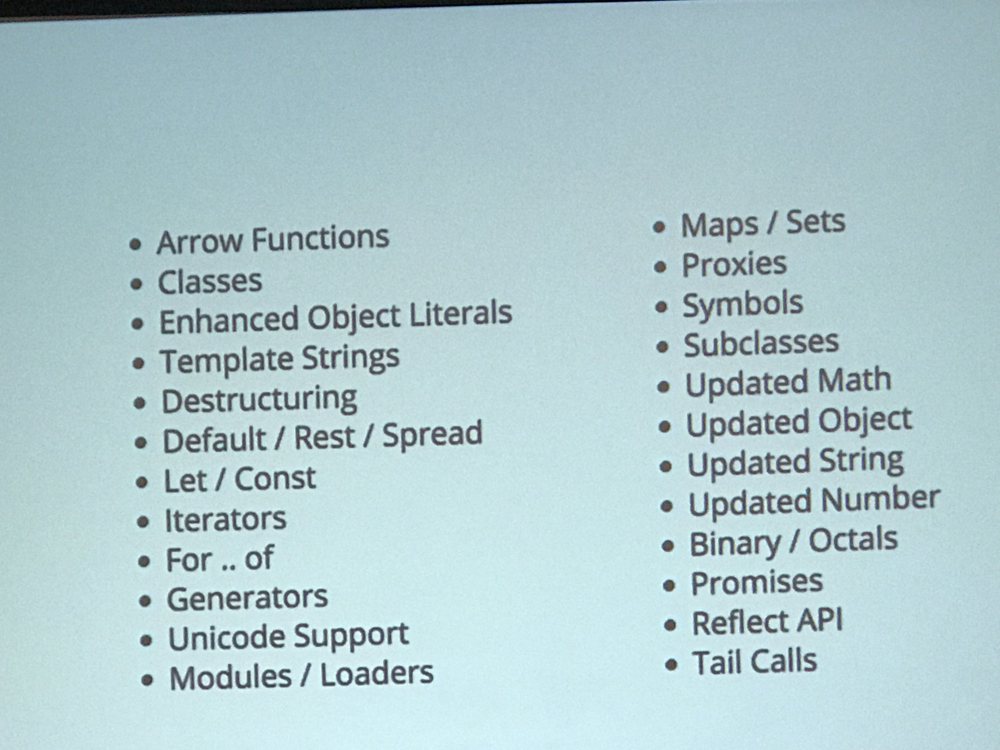
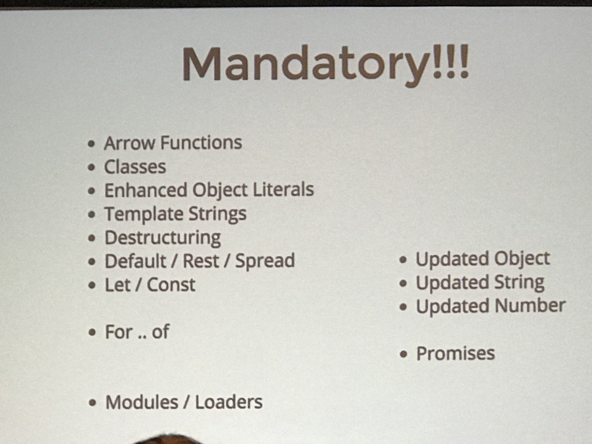
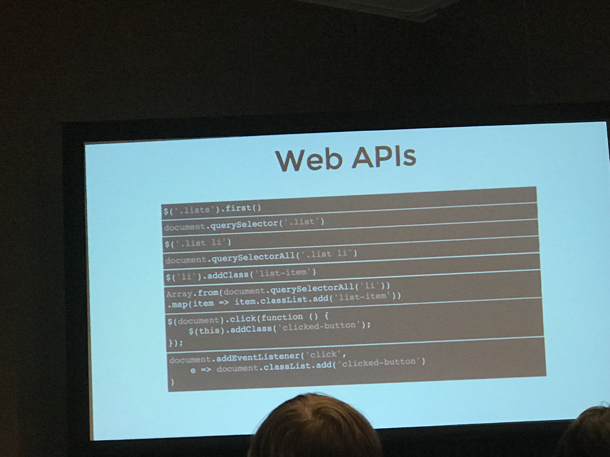
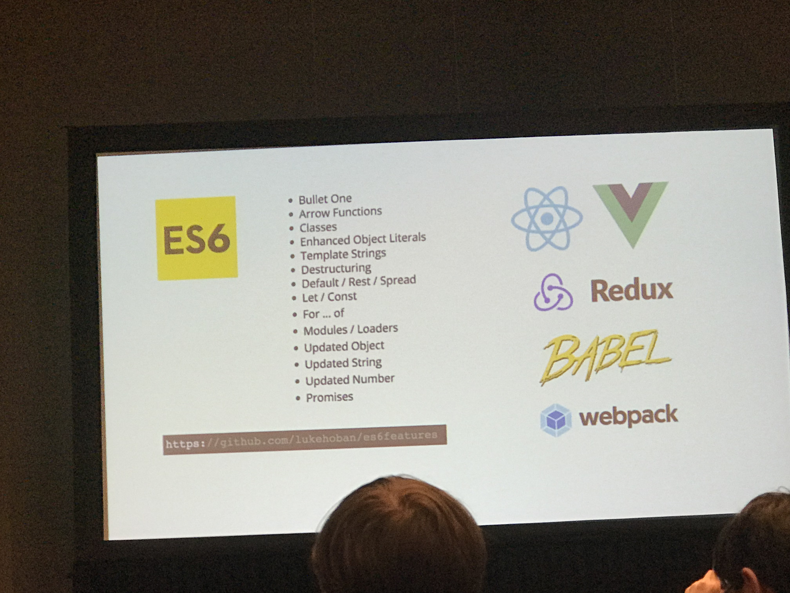
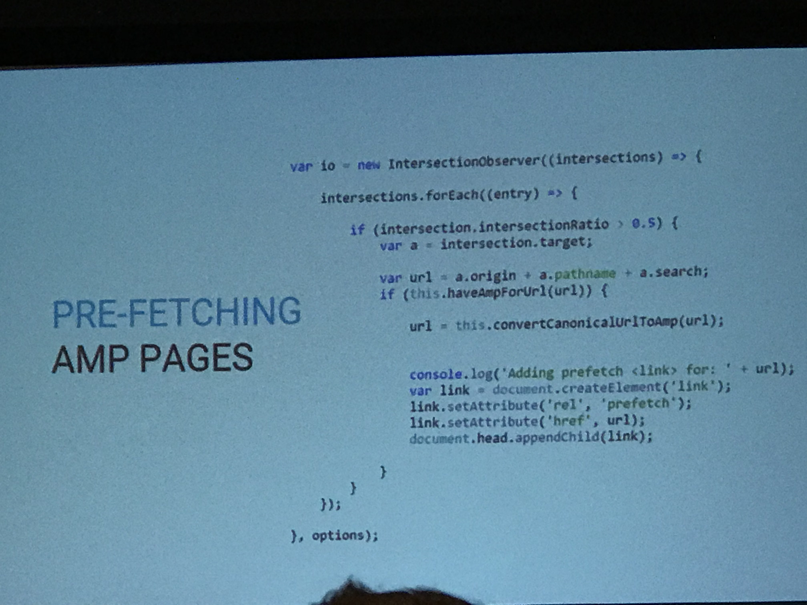

# Coding
<!-- TOC -->

- [Coding](#coding)
- [1. JS like it's 2018](#1-js-like-its-2018)
    - [1.1. Intro](#11-intro)
    - [1.2. Links](#12-links)
    - [1.3. History of Js](#13-history-of-js)
    - [1.4. ES6 (ES2015)](#14-es6-es2015)
    - [1.5. TOGO: WHAT TO LEARN](#15-togo-what-to-learn)
- [2. 4+ Billion AMP Pages: The Future of the Mobile Web *](#2-4-billion-amp-pages-the-future-of-the-mobile-web-)
    - [2.1. Intro](#21-intro)
    - [2.2. Links](#22-links)
    - [2.3. Notes](#23-notes)
    - [2.4. TOGO](#24-togo)
- [3. Building Mobile SDK's for the Real World](#3-building-mobile-sdks-for-the-real-world)
    - [3.1. Brief](#31-brief)
    - [3.2. TOGO](#32-togo)
- [4. The First Rule of ARIA Accessibility withought doing accessibility *](#4-the-first-rule-of-aria-accessibility-withought-doing-accessibility-)
    - [4.1. Brief](#41-brief)
    - [4.2. Links](#42-links)
    - [4.3. Notes](#43-notes)
    - [4.4. TAKE AWAYS](#44-take-aways)
- [5. America's Code: Open Sourcing Government Softwares](#5-americas-code-open-sourcing-government-softwares)
    - [5.1. Brief](#51-brief)
    - [5.2. Links](#52-links)
        - [5.2.1. Their Projects:](#521-their-projects)
- [6. Back-End to the Future:A/B Testing What Counts](#6-back-end-to-the-futureab-testing-what-counts)
    - [6.1. Brief](#61-brief)
    - [6.2. Links](#62-links)
    - [6.3. Learned](#63-learned)

<!-- /TOC -->
# 1. JS like it's 2018

## 1.1. Intro
Wait, you’re still using jQuery? That’s so 2013. JavaScript is advancing so quickly one of biggest problems for developers is an inability to keep up ("JavaScript fatigue"). Have you heard of ES2015 (ES6), ES2016, ES2017, Promises, React, Babel, Async/Await, or Webpack and wanted to learn more? In this session, we’ll discuss new features and syntax in the language itself, and we’ll talk about the tooling required to use the code in production today and long into the future.


## 1.2. Links
- [Examples at github](https://github.com/justin-schroeder/js-like-2018)
- [slides](http://slides.com/jpschroeder/js-like-2018#/)
- [ES6feature](https://github.com/lukehoban/es6features)
- [@jpschroeder](https://twitter.com/jpschroeder), justin@wearebraid.com
- [jpschroeder.com](https://www.jpschroeder.com/)
- [@wearebraid](https://twitter.com/wearebraid)
- [wearebraid.com](https://www.wearebraid.com/)
- [Recording](https://schedule.sxsw.com/2018/events/PP74574)

`Any application that can be written in JavaScript, will eventually be written in JavaScript` -- Jeff Atwood

## 1.3. History of Js
- The beginning
    - 1995 Mocha -> LiveScript -> Javascript
    - 1997 EcmaScript
    - 2000 - 2004: Nothing
    - 2005 Ajax /Prototype/dojo/
    - 2006 jQuery
- JavaScript Fatigue
<p align='center'>
    
</p>

## 1.4. ES6 (ES2015)
`I wish people would stop talking about ES8. I’m still not over that fact that there’s an ES6 that I still haven’t completely grasped yet.` — Sarah Soueidan
- Nice things in ES6
    - Arrow Functions
    - Classes
    - Destructuring
    - Modules
    - Promises
    - Rest
    - Template String

- All things in ES6
<p align='center'>
    
</p>
- Mandatory!
<p align='center'>
    
</p>    

ES6 -> tc vs Babel (*)
Pack -> browserify vs Webpack (*)

`Don't do webpack configuration`, because most of time, you will accidently load a same thing many time. instead, use tool.
- Angular-cli
- create-react-app
- vue-cli

- Web API * 
    - Aimation
    - Device Acceleration
    - Device Light
    - Device Proximity
    - Fetch
    - Gamepad
    - Payment Request *
    - Performance
    - Puch
    - Service Worker (proxy to the internet)
    - Speech Recognition
    - URL
    - Virtual Reality
    - WebGL
    - WebSocket
    - Query Selector

<p align='center'>
    
</p>  

## 1.5. TOGO: WHAT TO LEARN
- Mandatory
    - React/Vue
    - Redux
    - Babel (understand it)
    - Webpack
- ES6
    - Bullet One
    - Arrow Functions
    - Classes
    - Enhanced Object Literals
    - Template Strings
    - Destructuring

<p align='center'>
    
</p>  

# 2. 4+ Billion AMP Pages: The Future of the Mobile Web *

## 2.1. Intro
The Accelerated Mobile Pages (AMP) Project enables websites to provide fast, engaging user experiences. Now AMP has expanded beyond publishing to areas such as e-commerce, advertising, and powering entire websites - adding richer interactivity and support for Progressive Web Apps (PWAs). AMP delivers content at lightning speed with a reliably great user experience – whether for news, e-commerce, or the entirety of a website.

## 2.2. Links
- [wompmobile webiste](
https://www.wompmobile.com/)
- [AMP Project](ampproject.org)
- [AMP Youtube](youtube.com/TheAMPProject)
- [Contribute](bit.ly/helpAMP)
- [Twitter](twitter.com/amphtml)

## 2.3. Notes

How it all comes togther
- PWA Components
    - App shell
    - Persistent header & menu
    - Smooth transitions
    - Includes rich functionality
    - Intelligently loads AMP or non-AMP pages are required
- Service Worker
    - Operates in the background
    - Enables offline access
    - Strategic caching

How come the AMP PAGES
    - Accelerated Mobile Pages
        - Lightweight content units
        - Load instantly and smoothly update
        - Cached on CDN & Service Worker

Fast From Start to finish

Discovery -> Service Worker -> Super fast AMP page loads in PWA shell -> PWA provides rich interactions
-> Add to home screen icon for repeat business

The ultimate Mobile experience
PWA is the ultimate shopping experience

## 2.4. TOGO
- Pro Tip #1: Build Fully featured AMP Pages
    - AMP-BIND: Model Selection
    - AMP-LIST: GEO RELEVANT CONTENT
    - AMP-BIND: SEARCH AUTOCOMPLETE
    - AMP-BIND: Product filtering
    - AMP-FORM: Voting

- Pro tip #2: Make your PWA clairvoyant

    - Pre-fetching AMP pages (when wifi and battery is good, prefetch)

<p align='center'>
    
</p>  

- Pro tip #3: Reduce duplicate code
    - No javascript in header
    - checkbox hack for accordions

- AMP is now your mobile site
    - No more separate AMPs and mobile pages
    - no more dupliate engineering
    - one amp to rule them all


# 3. Building Mobile SDK's for the Real World

## 3.1. Brief
Creating an SDK for use on mobile platforms is a great way to allow your customers to use your product or service with less friction. Developing an SDK is fraught with difficulties and is vastly different from creating a normal mobile application. Drawing from lessons learned creating SDK’s used in 600 applications with 20m MAU processing 200m events/day, this talk will explain common pitfalls and techniques to use which make the process much easier.

## 3.2. TOGO
1. Simplify your code
- Limit points of failure
    - Limit use of internal state variables
    - Minimize code paths
    - Don't rely on startup routine
    (dont use the variable before verify it)
- Choose dependencies Carefully
    - Normally Great - Problematic in SDK's
- Logging Tells Your Story

2. Run trasparently - SDK's Sean not Heard
- Be vigilant in threading
- Perform regardless of granted permissions
    - Graceful degradation
- Error handling
    - Suppress dialogs, handle as much as you can

3. Release Seriously
- Versioniing is critical for debugging
- Build a release checklist for `everything` - and/or automate
- Sample Code / Sameple Implementation
    - Have a "simple" version to increase adoption
    - Advanced version shows all options
4. [Recording](https://schedule.sxsw.com/2018/events/PP77637)    


# 4. The First Rule of ARIA Accessibility withought doing accessibility * 

## 4.1. Brief
Universal access is something any master craftsman aims to achieve. Web developer's have standards such as ARIA. But the first rule of ARIA is don't use ARIA, use semantic markup instead. That's fine for headings, but surely interactive design patterns such as hamburger menus, accordions and hovers need extra work to make them accessible?.... Or do they? 
Come along and explore alternative ways of looking at common patterns and learn how to "do accessibility without doing accessibility".

## 4.2. Links
- [#ArialRule](https://twitter.com/hashtag/ariarule1?src=hash)
- [@dexterperrin](https://twitter.com/dexterperrin)
- [WAI-ARIA](https://www.w3.org/TR/aria-in-html/)
- [Inclusive design](https://www.microsoft.com/en-us/design/inclusive)
- [A11y: User Agent Implementation Guide](https://www.w3.org/TR/wai-aria-implementation/)
- [Aria Examples](https://www.w3.org/TR/2017/NOTE-wai-aria-practices-1.1-20171214/examples/button/button.html)
- [Aria Practice](https://www.w3.org/TR/wai-aria-practices-1.1/)

## 4.3. Notes
- Inclusive Design
    - Permanent at Touch, See, Hear, Speak
    - Temporary
    - Situational 
- WCA
    - Perceivable
    - Understandable
    - Operable
    - Robust
- First rule of Aria: [`don't use Aria`](https://www.w3.org/TR/aria-in-html/#rule1)
    - How a browser works
        - HTML -> HTML Parser -> DOM TREE -> Attrachment
    - Accessibility Tree
        - Chrome has a elements/A11y
- Second rule of Aria: `Do not change native sematic`
    - No aria is better than bad Aria
    - Mobie first -> content first

- What is Aria good for?
    - good for dynamic content

- Testing
    - Voice Over on Mac
    - Accessibility Inspector in Dev Tools
    - Audits/Lightouse in Chrome Dev Tools
    - Real customer
- Accessibility Tree
    - Accessible objects are created in the a11y tree for every DOM element that should be exposed to an assistive technology 

```
Tabs without aria
class="off-screen"

Hambergers without Aria
role="presentation"

Carousel
aria-hidden="true"
```

## 4.4. TAKE AWAYS
- Accessibility is part of your job
- Make the content accessible not the UX
- Embrace web standards
- Remember the first rule and keep it simple
- You will change peoples lives

# 5. America's Code: Open Sourcing Government Softwares

## 5.1. Brief
White House. Pentagon. NSA. They all began releasing more code last year following the first-ever Federal Source Code Policy. And now it’s easier than ever to access it. With thousands of projects to explore, Code.gov is transforming into the nation’s primary platform for sharing & improving government software. We’ll highlight the coolest projects & teach you how to give back to the country one pull request at a time. This is your code. Use it to spark America’s next breakthrough in innovation.

## 5.2. Links
- [code.gov websites](https://code.gov/#/)
- [Analytics tool](https://analytics.usa.gov/)
- [Recoding](https://schedule.sxsw.com/2018/events/PP75447)

FE: elasticsearch (https://www.elastic.co/)

BE: https://cloud.gov/

### 5.2.1. Their Projects: 
They have some cool projects, like helping NASA and AI. Tell driver basic on the current wind, how much chance if they load a certain heavy good, they will be in trouble with wind.

Recent launch project(I like this project):

https://code.gov/#/help-wanted

- if you are a coder/developer, take task from gov and give back to the country
- if you are only user, can do user testing and give feedback


# 6. Back-End to the Future:A/B Testing What Counts

## 6.1. Brief
In a world driven increasingly by automation, what does the future of a/b testing look like? Our panelists are experienced leaders at companies renowned for their approach to A/B testing - Facebook, Pinterest, and Shutterstock. While most tools today focus on front-end testing, we’ll talk about innovations in back-end testing to test prices and search algorithms and the use of machine learning to automate testing and drive increased personalization.


## 6.2. Links
- [#ABtestingtalks](https://twitter.com/hashtag/abtestingtalks?src=hash)
- [Recording](https://schedule.sxsw.com/2018/events/PP70470)
- [Slides](https://docs.google.com/presentation/d/1na0PqzoPetefylUfcBRInzgcqh2xup_93loYUgHLffE/edit#slide=id.p)

## 6.3. Learned

-  Basic ideas
    - Basic A/B Testing : 
    - Multivariate Testing :
    - Machine Learning :
-  A/B testing today
    - Facebook using home grown
    - Pinterest also use home brew and hybrid platform. Pin runs thousands of testing
    - Engineer work together with data scientists
    - Pinterest uses AB testing for recommendations
    - Simplified products is helpful for them
-  Analytics Tools
    - Business Intelligent team/ Build tools as business required (view history)
    - Built in house tools because want to own the data
    - Matrix will effect other team
    - Facebook built UI dashboard using d3, the dashboard can be shared, centralize data
    - Make sure not look at too many matrix at the same time
    - Time spend matrix on Pinterest
    - Segmentation, 
