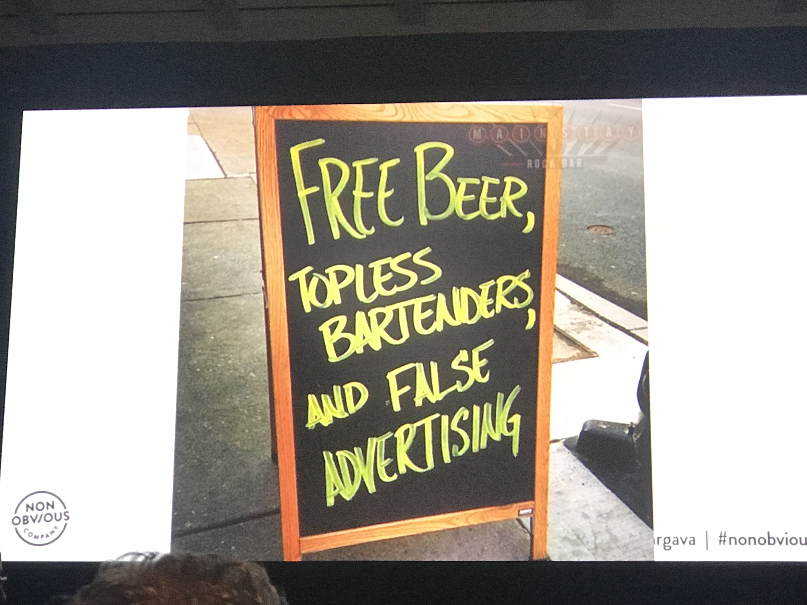

# Marketing
<!-- TOC -->

- [1. Non-Obvious Trends Changing the Future *](#1-non-obvious-trends-changing-the-future-)
    - [1.1. Intro](#11-intro)
    - [1.2. Links](#12-links)
    - [1.3. Notes](#13-notes)
- [2. Break & Re-Make Your Brand with Uber](#2-break--re-make-your-brand-with-uber)
    - [2.1. Intro](#21-intro)
    - [2.2. Links](#22-links)
    - [2.3. Notes](#23-notes)
- [3. Interactive KeyNote: Melinda Gates](#3-interactive-keynote-melinda-gates)
    - [3.1. Intro](#31-intro)
    - [3.2. Notes](#32-notes)

<!-- /TOC -->
# 1. Non-Obvious Trends Changing the Future * 
## 1.1. Intro
Join us for a presentation of the latest trends and research from the popular Non-Obvious Trend Series. With over 100 trends predicted over eight years, this WSJ best selling research series by trend curator Rohit Bhargava has been used by some of the largest organizations in the world. This all new talk will feature seven never before seen trends from the new 2018 edition of the research series, and offer actionable tips for the audience on how to use these trends to get ahead.

## 1.2. Links
- [Slides](http://www.rohitbhargava.com/sxsw)
- [All Trends](http://www.nonobviouscompany.com/alltrends/)
- [His book: Non-Obvious 2018 Edition](https://www.amazon.com/Non-Obvious-2018-Predict-Trends-Future/dp/1940858429)
- [Recording](https://schedule.sxsw.com/2018/events/PP77738)

## 1.3. Notes
- We need this to solve the 3 biggest challenges. 
    - Innovations
    - Motivation
    - Engagement 

- Banner blindness
    - The truth has a media & marketing problem
    - Now cosumer became skeptical, they don't trust what they see.
    - This is noise at the ad

    

- Curating your ideas
    - Trend curations
- TREND 1: Manipulated outrage
    - the outrage industry
    - Stephen Crowley's story
    - STEAL THIS IDEA!
        - Respect the outrage, but rise above it
        - Recognize it
- TREND 2: Ungendered
    - Facebook's evolving gender selecor
    - Gender X Passports and IDs
    - STEAL THIS IDEA! 
        - Reevaluate products, services and marketing to identify gender bias
- TREND 3: Human code
    - Human Library
    - Social Robots with Personality 
    - Tesco Relaxed (Slow) Checkout line
    - STEAL THIS IDEA! 
        - Selectively add a human  option as a benefit
        - (more human)

- TREND 4: Light-speed Learning
    - 8 year old drivers to McDonald's
    - Tasty Cooking tutorial videos
    - Fender Play
    - Microsoft Power BI + Non-Obvious Trends
    - STEAL THIS IDEA! 
        - Reinvented

- TREND 5:Enlightened Consumption
    - Intermarche Inglorious Foods (US Walmart do the same thing)
    - Chobani Yogurt
    - Lifter Leadership 
    - Transformative Travel
    - STEAL THIS IDEA! 
        - Take a stand that demonstrates your values to customers and employees. 

- TREND 6:Disruptive Distribution
    - Casper & Online Mattress Startups
    - Deliveroo "Kitchen-only Restaurants
    - Flexe: Warehouse share
    - Relonch Camera (pay for better photo)
    - Media Business Model Transformation
    - STEAL THIS IDEA! 
        - Rethink business models, promotion, partnerships and distribution

- TREND 7:Lovable Unperfection 
    - Hutzler 571 Banana Slicer (one of the best seller)
    - Hans Brinker Buget Hotel, Amst (worst place to live, but has stories. ) set down expectation
    - STEAL THIS IDEA! 
        - Show your warts and work!
        - No afraid to tell the truth. so they won.
- One final tip to help you:
    - Sometime you need to commit yourself

# 2. Break & Re-Make Your Brand with Uber

## 2.1. Intro
When Bozoma Saint John joined Uber as its first ever Chief Brand Officer, she knew that shifting the culture and perception of the ride-sharing giant would be no small feat - but Bozoma loves a good challenge. Hear her share tips and strategies for evolving brands with bold campaigns, compelling storytelling and of course, a good dose of style and flair.

## 2.2. Links
- [Recording](https://schedule.sxsw.com/2018/events/PP99056)

## 2.3. Notes
- BOZOMA Saint John in Conversation with Jo Ling Kent
- Share a video with Uber Rider
- Fail fast: You gotta to try many things and fail fast then you have chance to grow

- How to win customer back
    - Uber driver wanted what? make driver feel more comfortable
    - Human story to win customer back

- Priority new customer vs old customer back
    - we should pay attention to all

- Want Uber look like in 1 year?
    - Real change, diversity

# 3. Interactive KeyNote: Melinda Gates

## 3.1. Intro
In the past half century, the American workforce has transformed. The American workplace has barely changed at all. Until now. 
Join Melinda Gates and a panel of innovators for a dynamic conversation about the way new technologies, new business models, and new social movements are redefining what it means to go to work. This is a moment of limitless potential—for inclusion, for creativity, and for building the first workplace in history that truly works for everyone.

## 3.2. Notes
- You can shape the world around you. Make the workplace a better place
- Every ralationship should be equal: at home or at work
Role modeling from a Morther
- Young women at the work