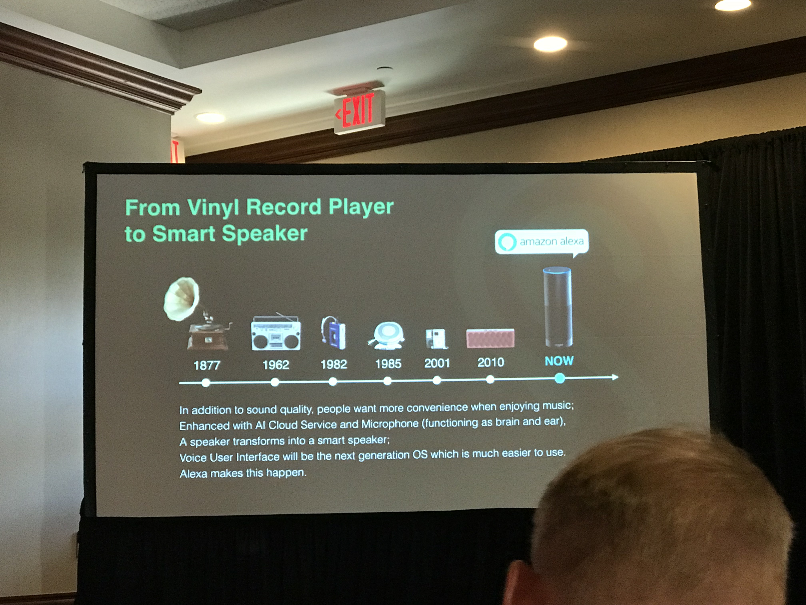
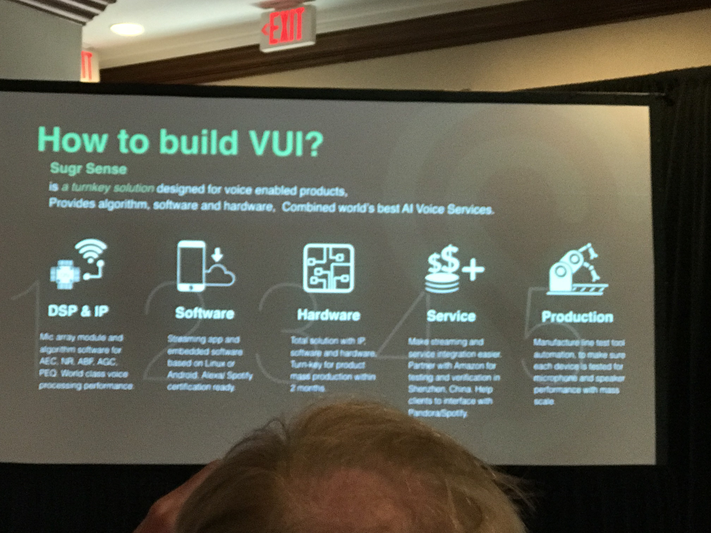

# Startups
<!-- TOC -->

- [Startups](#startups)
- [1. SXSW Accelerator Pitch Event](#1-sxsw-accelerator-pitch-event)
    - [1.1. MillionJobs](#11-millionjobs)
    - [1.2. ICON 3D](#12-icon-3d)
    - [1.3. Moms Can: Code](#13-moms-can-code)
    - [1.4. Samaritan](#14-samaritan)
- [2. Think Like a Startup: How Innovation Gets Done](#2-think-like-a-startup-how-innovation-gets-done)
- [3. How Future Tech Will Shape Our engagement with Others](#3-how-future-tech-will-shape-our-engagement-with-others)
    - [3.1. How will smart voice serviceaffect our engagement?](#31-how-will-smart-voice-serviceaffect-our-engagement)
    - [3.2. Self-driving: AI Evolution and massive deployment in production cars](#32-self-driving-ai-evolution-and-massive-deployment-in-production-cars)
    - [3.3. How to build intelligent Eyes for AI Machines](#33-how-to-build-intelligent-eyes-for-ai-machines)

<!-- /TOC -->
# 1. SXSW Accelerator Pitch Event
## 1.1. MillionJobs

- Website: https://www.70millionjobs.com/
- Brief: 70 million people has a record, so it's a big market to help them find the job. (quoted: `Huge, unserved market`). 70 MillionJobs at Y Combinator. No. Seed Round. Blockchain to Trackle Recidivism
- Contact: Richard@70millionjobs.com
- How 70 million people find you?
    - work with organations and do advertising
    - offer people job but not waiting them to find job
    - call people to make sure they show up in the interview
- They spent first 6 months gathering people and then find hires in the following 6 months

## 1.2. ICON 3D
- Download and print a home in 24 hours for half the cost
- ICON is a construction 
- https://iconbuild.com/
- Build your house with 3D printer

## 1.3. Moms Can: Code
- https://www.momscancode.com/
- Moms can do anything
- How long is the program
  - start Aug. stay around with communities

## 1.4. Samaritan
- https://www.samaritan.city/

# 2. Think Like a Startup: How Innovation Gets Done

- Why Corporation need?
    - When idea comes, just built it quickly and test it quickly. Move quickly
    - Fail fast

- Too risky. depends on leadership from top?
    - From start up learder: want to hear crazy idea, be resilient, unpredictablitiy 
    - Should be adaptable

- What if vision is bad? vision is right but actions are not?
- How think about risky?
    - depend on what you define risky
    - if not going to corporate job but doing startup is risky?
    - social parts (friends/family)
    - if you want to be diferent, you have to behavior deferently
    - try to re-innovate ourselves
- Walmart.com/ Marc Lore
    - change can happen and change can be cool
    - (It's interesting that they mentioned Marc Lore's podcast)

# 3. How Future Tech Will Shape Our engagement with Others

## 3.1. How will smart voice serviceaffect our engagement?
    - Why Voice User Interface?
    - sugi: http://www.sugrsense.com/
    - AI is to help human reduce efforts. From mouse to voice. Save energy => Baic rule for Human machine interface
    - Example for human access music:

    

    From ... to amazon alexa follow the rule

    - Difference bettween customers in US and China
        - Usa: golden generation grew up on wheels Radio(Background music). Playlist. Streaming audio
        - PRC: 70s, 80s generation, Cassettes (Signers & Songs. on-demand

    - Scenarios & Behabiors shape the products
    - How will Vui influence our life?

    - Human with machine relationship has changed a lot. it's not only code widgets.

    

## 3.2. Self-driving: AI Evolution and massive deployment in production cars
- https://www.xiaopeng.com/en/
- Transportation revolution and autonomous driving
    - XPENG MOTORS make things happen and evolve
    - p0: Primitive: horse
    - p1: Analog device
    - p2: Digitalization
    - p3: Intelligence
- Tree pillars of autonomous driving
    - Big Data Genome
    - AI algorithm 
- Personified, geographically differentiated driving

## 3.3. How to build intelligent Eyes for AI Machines
- eyemore: Power AI Machine with better-than-human-eye Imaging Engine
- Machine's Evolution Drivern by AI
