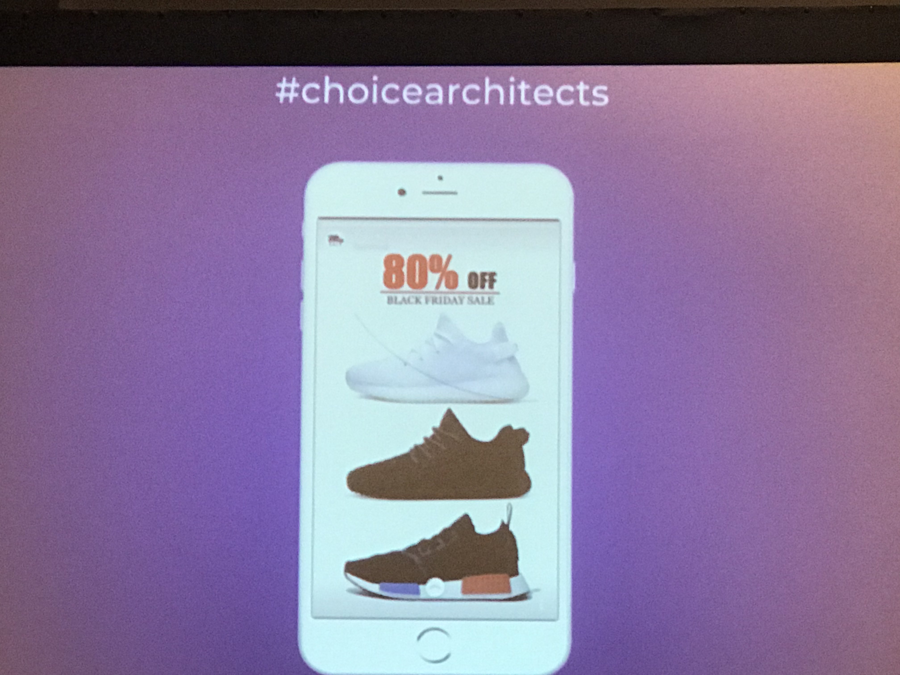

# Design
<!-- TOC -->

- [Design](#design)
- [1. Choice Architects (Design for Humanity's Best Self)](#1-choice-architects-design-for-humanitys-best-self)
    - [1.1. Intro](#11-intro)
    - [1.2. Related Links](#12-related-links)
    - [1.3. Learning](#13-learning)
    - [1.4. TOGO: How to avoid dark patterns and promote design ethics](#14-togo-how-to-avoid-dark-patterns-and-promote-design-ethics)
- [2. Experience Design, the new(seamless) marketing era](#2-experience-design-the-newseamless-marketing-era)
    - [2.1. Intro](#21-intro)
    - [2.2. Notes](#22-notes)
- [3. Design in the Era of the Algorithm](#3-design-in-the-era-of-the-algorithm)
    - [3.1. Intro](#31-intro)
    - [3.2. Links](#32-links)
- [4. Changing Minds: Behavioral Science for Designers](#4-changing-minds-behavioral-science-for-designers)
    - [4.1. Intro](#41-intro)
    - [4.2. Notes](#42-notes)
- [5. Animation in UX: Subconscious Influence of Motion](#5-animation-in-ux-subconscious-influence-of-motion)
    - [5.1. Intro](#51-intro)
    - [5.2. Links](#52-links)
    - [5.3. TAKE AWAYS](#53-take-aways)

<!-- /TOC -->
# 1. Choice Architects (Design for Humanity's Best Self)

## 1.1. Intro
Today’s digital landscape feeds our lizard brains and reduces complex moral dilemmas to the swipe of a thumb. As product creators, we have a responsibility to present people with a set of choices to enable them to be the best version of themselves. This panel will discuss examples of dark user interface patterns wreaking havoc on our lives. We will empower you to positively impact humanity through products designed for a world that doesn't suck.

## 1.2. Related Links
- [Their website](http://quinnryan.com/)
- [#choicearchitects](https://twitter.com/hashtag/choicearchitects?src=hash)
- [Events](https://sites.google.com/prod/view/choicearchitects/home)
- [Recording](https://schedule.sxsw.com/2018/events/PP73303)

## 1.3. Learning
- Fun to know:
  - `We touch our phones an average of 2,617 times a day`
  - `Our biggest competitor is sleep... and we're winning.` -by Netfix CEO 
- Dark Patterns: Interfaces that have been crafted to trick users into unintentionally doing things
  - short term thinking vs long term thinking
  - Bad Product matrix. For example, Time spend on site => bad UX (confusing navigation)

      

 
[exmaple of hair in the screen want to increase ad open times!]

- Cognitive Bias: The tendency of people to erroneously perceive information and make irrational decisions based on their own experiences and preferences
  - Designers will have responsibility to step in and manage the KPI and the humanity

- Choice Architecture: The way chocies are presented to people will impact their decision-making.

## 1.4. TOGO: How to avoid dark patterns and promote design ethics
  - Always examine choice architecture
  - Know your audience and their intentions
  - Solve the right user problem (jobs to be done)
  - Make user research a full-team process
  - Build a diverse team and reward good behavior
  - Work with partners on problem alignment before solutions

# 2. Experience Design, the new(seamless) marketing era
## 2.1. Intro
This session will discuss why people buy experiences and not things, the role of interactive media as a marketing solution when designing experiences, and ways technology can further enhance design experience.
## 2.2. Notes
- Shopping for stories, selling connections
- It's luck to have a IP with potentials to extend: `West world` Bring west world to live
- Steven from HBO (really good at telling story)
  - "make people feel excited"
  - Like harry potter world. make people have real experience in the film
  - Immesive design experiece: have dinner with actress. 
- Campbell (Global Events Director from Louis Vuitton)
  - Fashion travel: inclusive design
  - localization and globalization 
  - make it relatable 
  - using facebook and instagram to create experience
  - Biggest mistake in the marketing events: make it most forgetable. 
- Brazil music
  - natura musical
  - deliver music content
  - musician interact with audience
  - KPI about events
    - What people talking about/ when they come in and leave

# 3. Design in the Era of the Algorithm
## 3.1. Intro
Designers have an urgent role to play in crafting the emerging generation of AI interfaces. This hour explores a rich set of examples—both entertaining and sobering—that unearth 10 design principles for creating responsible machine-learning applications. Learn to use AI as design material in your everyday work. Anticipate the weird, unexpected or incorrect conclusions the machines sometimes deliver. Above all, scrub data for bias to create a respectful and inclusive world we all want to live in.

## 3.2. Links
  - [Recording](https://schedule.sxsw.com/2018/events/PP72150)
  - [Speach](https://bigmedium.com/speaking/design-in-the-era-of-the-algorithm.html)

# 4. Changing Minds: Behavioral Science for Designers

## 4.1. Intro
When building technologies, we often have specific behavioral goals in mind: things we want users to think, feel, and do. Before, our research & design processes rarely included behavior change science. That's no longer true. Join a Chief Behavioral Officer, a Researcher, and a UX Designer for debate about psychology-based methods for product and service design. They’ll share experiences about working to translate the science into actionable practice.

## 4.2. Notes
- (It's a late presentation, so he asked people to stand up to do mirror tricks)
- What cause Behavior change?
  - Motivation
  - B=mat
  - simplicity change people mindset/behavior
- design for human connection
- It took nearly 50 years for people to accept the automated lift
- How do you design for TRUST?

# 5. Animation in UX: Subconscious Influence of Motion
Katie Swindler
## 5.1. Intro
If you’re not leveraging interface animations to influence your users, you are missing a critical component of UX design. Like body language, motion design supplies a rich, often-subconscious layer of meaning & personality to every micro-interaction. Digital products can leverage the same techniques used by cartoon animators, actors & dancers to convey personality, improve comprehension & influence behavior through movement. Learn the right animation styles for your brand, users & product.

## 5.2. Links
  - [Book: Designing Interface Animations](https://www.amazon.com/Designing-Interface-Animation-Meaningful-Experience/dp/1933820322)
  - [UX in Motion Manifesto](https://medium.com/ux-in-motion/creating-usability-with-motion-the-ux-in-motion-manifesto-a87a4584ddc)
  - [Optimistic UI](https://uxplanet.org/optimistic-1000-34d9eefe4c05)
  - [Disney’s 12 Principles of Animation: The Illusion of Life](https://ohmy.disney.com/movies/2016/07/20/twelve-principles-animation-disney/)
  - [UX in Motion’s response: “UI Animation Principles: Disney is Dead”](https://medium.com/ux-in-motion/ui-animation-principles-disney-is-dead-8bf6c66207f9)
  - [Accessibility: “More Resources for Accessible Animation”](http://alistapart.com/blog/post/more-resources-for-accessible-animations)
  - [@MadamAutonomous](https://twitter.com/MadamAutonomous)
  - [Related talk](https://vimeo.com/255578630)
## 5.3. TAKE AWAYS
- Convince your team to include animation
  - Pick a real problem to solve that contributes to a business objective
  - Play to Animation’s strengths
      - Make clear connections
      - Reduce clutter
      - Perception of speed (Optimistic UI)
      - Create a narrative
      - Celebrate progress
  - Animate in a style that is true to your brand
- Pick the right animation styles for your brand
	- Start with your brand traits
	- Collect examples of movement that embody each trait
	- Work with a developer to translate to programmable traits - easing, bounce, etc.
	- Create guidelines for entrances, exits, object relationships, attention & transformations
	- Try your guidelines on real work. Tweak and expand as needed.